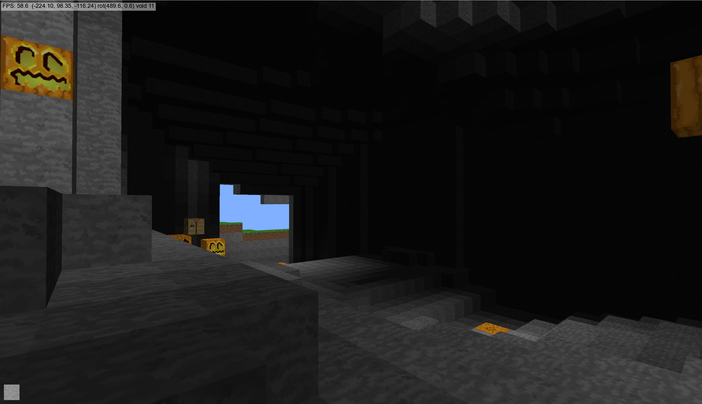
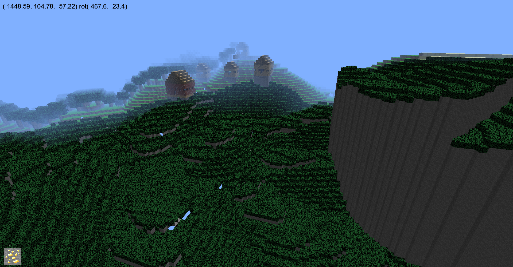
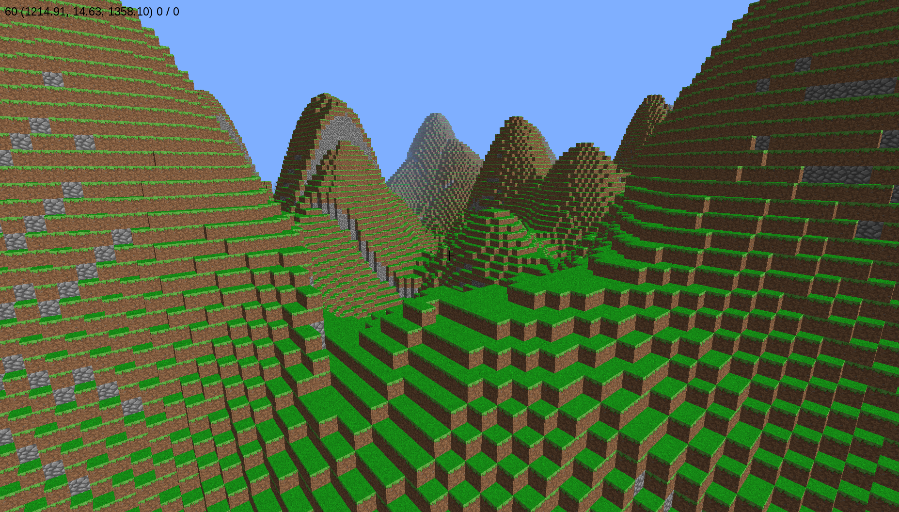

# Minepy

Minepy is a fork of a fork of fogleman's simple Minecraft-inspired voxel world demo (https://github.com/fogleman/minecraft) written in Python. 12 years ago, I started working on the original fork with the help of my then 6 and 7 year old sons and abruptly stopped for various reasons. On an AI-inspired impulse, I have decided to revisit it in late 2025. In that time, Python 2 was long ago replaced by Python 3, Pyglet 1 (fixed function graphic pipeline) by Pyglet 2 (Shaders!), and the world has moved on from Minecraft clones!


## Why revisit?

The best part of Minecraft is the ability to build unique blocky worlds. In my view this is even more fun if you can do it in a high-level programming language like Python. Check out `mapgen.py`. This is just the start.



## How to Run (Python 3)

This should work on Windows with any recent version of Python 3. For mac/linux you might need a different lmdb package. Assuming you have Python and Git already installed:

```
pip install pyglet numpy lmdb
git clone https://github.com/spillz/minepy2.git
cd minepy2
python main.py
```

There are constants in `config.py` that you can edit to tune the game and experiment with things.

## How to Play

This is not a survival game (yet). There is no day/night cycle (yet), no mobs (yet), no player avatars (yet). Just explore and build.

Moving

- W: forward
- S: back
- A: strafe left
- D: strafe right
- Mouse: look around
- Space: jump
- Tab: toggle flying mode

Building

- Use the number keys or mouse wheel to select the type of block to create:
- Mouse left-click: remove block
- Mouse right-click: create block
- Note that Jack O'Lanterns will provide a source of light in dark places

Quitting

- ESC: release mouse, then close window



## Anything else?

There is a server that runs in the background. This can also run standalone (see `server.py`) and that will allow you to host a multiplayer game on a LAN. I'll document that properly one of these days.

I'm also working on a JavaScript version. Why? Mostly because it runs in the browser. Also because JavaScript runs a lot faster than Python so it will be an interesting comparison.

This is how the game looked 12 years ago.



## Licenses

Source Code: MIT License

Copyright (C) 2025 by Damien Moore

Original Sources Copyright (C) 2013 Michael Fogleman

(Primarily some of the code in the `main.py` and `util.py` modules)

```
Permission is hereby granted, free of charge, to any person obtaining
a copy of this software and associated documentation files (the "Software"),
to deal in the Software without restriction, including without limitation
the rights to use, copy, modify, merge, publish, distribute, sublicense,
and/or sell copies of the Software, and to permit persons to whom the
Software is furnished to do so, subject to the following conditions:

The above copyright notice and this permission notice shall be included
in all copies or substantial portions of the Software.

THE SOFTWARE IS PROVIDED "AS IS", WITHOUT WARRANTY OF ANY KIND, EXPRESS OR
IMPLIED, INCLUDING BUT NOT LIMITED TO THE WARRANTIES OF MERCHANTABILITY,
FITNESS FOR A PARTICULAR PURPOSE AND NONINFRINGEMENT. IN NO EVENT SHALL THE
AUTHORS OR COPYRIGHT HOLDERS BE LIABLE FOR ANY CLAIM, DAMAGES OR OTHER LIABILITY,
WHETHER IN AN ACTION OF CONTRACT, TORT OR OTHERWISE, ARISING FROM, OUT OF OR IN
CONNECTION WITH THE SOFTWARE OR THE USE OR OTHER DEALINGS IN THE SOFTWARE.
```

Texture Pack - Faithful Venom v1.5

Faith Venom is licensed CC BY-NC-SA 3.0
http://minecraft.curseforge.com/texture-packs/51244-faithfulvenom-32x-32x
